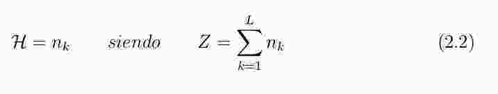
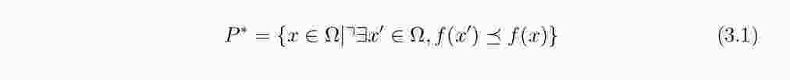

# Abstract
---------------
> One technique often used is the Contrast Limi-
ted Adaptive Histogram Equalization (CLAHE). However, it presents a challenge
in the selection of optimal parameters,

No queda muy claro a qué se refiere con 'optimal parameters'

> The results obtained from the multiobjective optimization process and the correlation show that the techniques (local entropy) and textit structural similarity index (SSIM ) have a high negative correlation, so the problem must be posed in a multiobjective context based on non-domination.

Reescribir, no se hila bien la idea.

# Introducción

> Sin embargo, éste y la mayorı́a de los otros métodos de mejora
de contraste pueden producir imágenes de aspecto no naturales, lo que ocaciona
que aquellas obtenidas por estos métodos no son las deseables.

Citar métodos de mejora de contraste.

> Existen enfoques
de mejora global y local.

Agregar citaciones

> Si se usa sólo información global, no se alcanza un buen
realce de contraste debido a que las técnicas globales podrı́an causar un efecto
de saturación de intensidades.

Agregar citación

> La principal finalidad de la optimización multi-objetivo robusta es la obtención del
Frente de Pareto de un conjunto de imágenes

Agregar citación

> En la literatura, los enfoques de mejora local demuestran ser sumamente útiles

Agregar citación

> Se utilizará una metaheurı́stica de optimización de objetivos SM P SO, de mane-
ra a sintonizar los parámetros de entrada del algoritmo de mejora del contraste
CLAHE y de esta forma obtener un grupo de imágenes contrastadas, las cua-
les serán evaluadas en cuanto a la ganancia de información proveı́da y distorsión
introducida por la ecualización.

Aquí sí se debería justificar el trabajo realizado, y agregar citación para 'SMPSO'. Además, se debe poner énfasis en que se hace una *selección de métricas* primeramente y luego una *optimización robusta*.

### Objetivo General

```python

```

# Capítulo 2

### Imagen Digital

> Una imagen digital es una imagen F (i, j) que se ha discretizado

Se definió dos veces 'imagen digital'.

> En la Ecuación 2.1

F mayúscula.

> El pı́xel p (del inglés picture element) es el elemento más pequeño que forma la
imagen, es interpretado generalmente como una entidad cuadrada o rectangular.
En la Figura 2.2 se muestra la representación de una imagen de 8x8 pı́xeles y la
matriz correspondiente a la imagen con el valor de la intensidad de cada pı́xel.

Se debería definir ésto antes, porque arriba en el capítulo ya se definió lo que es un nivel de intensidad.

> Las imágenes en escala de gris utilizan niveles de gris donde cada nivel equivale
a una graduación de gris comprendido entre el negro y el blanco [Rus10].

Se debió definir antes.

> Por ejemplo, si se utilizan 8 bits, se puede
representar 256 niveles de gris distintos que van del 0 (negro) al 255 (blanco).

Formular.

### Mejora de imagen

> No se añade información nueva que no esté presente en la imagen. Tan solo
se resalta la información existente, para que pueda ser apreciada de mejor
manera por el ojo humano.
La valoración de los resultados es subjetiva, debido a que no existe un criterio
para saber que tanto se mejoró la imagen original, por lo regular se emplean
varias pruebas sobre la imagen hasta obtener los resultados más adecuados.

La información podría utilizarse en otros procesos automáticos.

> Las técnicas consisten en operaciones directamente sobre un pı́xel sin tomar en
cuenta a los pı́xeles vecinos, que sirve para mejorar condiciones de bajo contraste,
baja luminosidad o demasiada obscuridad; y operaciones sobre un pı́xel tomando
en cuenta a los pı́xeles que lo rodean, lo cual ayuda a eliminar ruido o para el
mejoramiento de la nitidez.

Agregar citación.


### 2.4. Mejora de Contraste

> La idea en este tipo de transformación es modificar los valores de los pı́xeles de
manera que se produzca un aumento en el rango dinámico de valores de los valores
de niveles de gris de la imagen, modificar los niveles de gris oscuros por unos más
claros y viceversa y ası́ aumentar la diferencia de intensidad entre los pixeles
[KHLF06].

Definir rango dinámico.

 


Ésta ecuación no está bien escrita. H no guarda relación alguna con Z. En todo caso, se debería escribir directamente H en función a n_k. Revisar bien.

> es decir k 0 = Ecualizado (k) ver 2.7.

Reescribir.

> AHE, (por sus siglas en inglés Adaptive Histogram Equalization) procesa la imagen
por subregiones (regiones rectangulares de la imagen), o regiones contextuales,
con dimensiones de región definidas como (R i , R j ), sobre las cuales se aplica el
procedimiento de ecualización de forma independiente, mejorando localmente el
contraste [LLK13].

Ponele la citación después de describir las siglas.

> Luego asignar un nuevo valor de
intensidad al pı́xel de acuerdo a la función de mapeo [KJ91].

¿cuál función de mapeo?

# Capítulo 3



Ésta ecuación no está bien descrita.

> El objetivo de los métodos de optimización multiobjetivo es encontrar el conjunto
de soluciones no dominadas y no una solución única.

No se definió previamente qué es una solución dominada o no dominada.

### 3.1.2. Speed-constrained Multi-objective PSO (SMPSO)

# Capı́tulo 4

Antes de la sección 4.1, se debería explicar la finalidad de la selección de métricas, además de describir brevemente y sin entrar en muchos detalles el proceso de selección. Se debería indicar que se hizo un relevamiento del estado del arte para luego seleccionar métricas de acuerdo al criterio de correlación.

Incluir una figura con las mediciones de métricas para cada caso.

# Capı́tulo 5

> Ası́ como también obtener una solución óptima para un grupo de imágenes del
mismo tipo a través de la optimización multiobjetivo utilizando las métricas se-
leccionadas con anterioridad.

Solución robusta, o solución que sea útil para varias imágenes del mismo tipo.

> ~~Se buscan métricas cuyos valores sean los más adecuados, de manera a obtener un resultado satisfactorio con respecto a la contradicción existente entre mejora del
contraste y distorsión de la imagen en escala de grises.~~

~~resultado satisfactorio en referencia a la caracterización de la naturaleza contradictoria existente entre mejora del contraste y distorsión de la imagen en escala de grises.~~

> ~~Ecuación 5.3~~

~~Está mal escrita. Si lo que se desea maximizar es el vector de objetivos, entonces solamente se debe escribir max(T). O si lo que se buscó escribir es tener un vector de objetivos tal que sus objetivos sean los máximos entonces T= max(I_f,S_F). Ojo con esta formulación que es fundamental.~~

> Ecuación 5.4 y 5.5

Si se está promediando, se debe dividir con la cantidad de ocurrencias del evento. Creo que en este caso debe ser contra la cantidad de resultados obtenidos.

> Lı́nea 5: Se calcula la velocida de cada partı́cula.

velocidad

# Capítulo 6

> Fue modificada para computar el cálculo del f itness, basandonos en que se desea máximizar la cantidad de información de la imagen y minimizar la distorsión de la misma.

basándonos
maximizar

> se toman como base las implementaciones existentes en Matlab.

agregar citación a matlab

> ~~Resultados de la correlación de Pearson usando Entropı́a (H ), Entropı́a Local (E ), SSIM y LTG, para imágenes de tórax frontal.~~

~Resultados de promediar la correlación de Pearson~~

> ~~Se utilizó la correlación de Pearson para medir el grado de relación de los pares de métricas, que serı́an utilizados como funciones objetivos en la evaluación de las
imagenes mejoras.~~

~~fueron utilizados como funciones objetivo en el proceso de optimización Robusta.~~

~~En la tabla 6.3 se promedió lo que se obtuvo en las tablas 6.1 y 6.2. Tal vez se pueda eliminar.~~

**el análisis del hipervolumen es insuficiente, recuerdo que les dije que hay que poner que haríamos la comparación para ver que los frentes robustos son consistentes. Hay que explayar un poco eso. Tal vez indicar que los hipervolúmenes indican que las pruebas fueron suficientes en cantidad para tener resultados pareto.**

# Capítulo 7

### 7.2. Trabajos Futuros

> ~~Los resultados experimentales obtenidos en Tabla 6.3 muestran que los pa-res de métricas Entropı́a local/SSIM demuestran ser los más contradictorios según la correlación obtenida, por tanto son más adecuado para incorporar a un proceso de optimización.~~

~~más adecuados para incorporar a un proceso de optimización~~

> ~~Los resultados de las imágenes generales para SMPSO-CLAHE muestran una mejora en el contraste, manteniendo la apariencia natural de las mismas.
Este algoritmo se muestra aplicable tanto en imágenes médicas o biométricas, mostrando resultados satisfactorios.~~

~~¿imágenes generales?~~

#Otras consideraciones

Hacer un poco más de hincapié en la optimización robusta en los resultados y discusión.