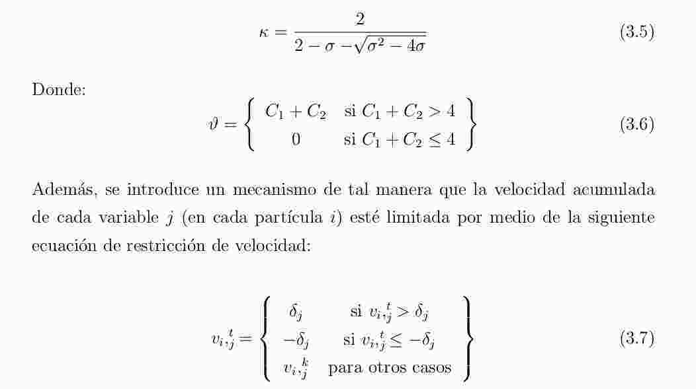

# Abstract
---------------
> One technique often used is the Contrast Limi-
ted Adaptive Histogram Equalization (CLAHE). However, it presents a challenge
in the selection of optimal parameters,

No queda muy claro a qué se refiere con 'optimal parameters'

> ~~In this work we propose a study of different metrics available in the literature,
in order to define, based on a correlation study, which will be used~~

~~mejor sería 'which will be selected'~~

> The results obtained from the multiobjective optimization process and the correlation show that the techniques (local entropy) and textit structural similarity index (SSIM ) have a high negative correlation, so the problem must be posed in a multiobjective context based on non-domination.

Reescribir, no se hila bien la idea.

> ~~In addition it is observed that SM P SO is a feasible tool for the calculation of non-
dominated solutions~~

~~Esto debería sacarse, porque no sé si cómo se fundamenta ésta afirmación.~~

> ~~Las pruebas experimentales realizadas muestran que es factible obtener Frentes de
Pareto Robusto, ver definición de formula en 5.6,~~

~~No se debería hacer referencias a partes del libro en el abstract, porque se supone que el lector todavía no está adentrado en el tema.~~


# Lista de Acrónimos

> ~~Speed-constraine Multi-objective PSO~~

~~Speed-constrained multi-objective PSO~~

> ~~MOPSO Multi Objective Swarm Optimizer.~~

~~Multi Objective Pareto? Swarm Optimizer~~

> ~~GM Ggradient Magnitude.~~
> ~~GSIM Ggradient Similarity Index.~~

~~Gradient~~

# Lista de símbolos
> ~~Indices de M y N.~~

~~Índices~~

> ~~Conjunto de imagenes.~~

~~imágenes~~

# Introducción

> Sin embargo, éste y la mayorı́a de los otros métodos de mejora
de contraste pueden producir imágenes de aspecto no naturales, lo que ocaciona
que aquellas obtenidas por estos métodos no son las deseables.

Citar métodos de mejora de contraste.

~~Ocasiona~~

~~No sean las más adecuadas~~

> Existen enfoques
de mejora global y local.

Agregar citaciones

> Si se usa sólo información global, no se alcanza un buen
realce de contraste debido a que las técnicas globales podrı́an causar un efecto
de saturación de intensidades.

Agregar citación

> ~~con el fin de ofrecer al algoritmo
que tomará las decisiones (Decision Maker - DM)~~

~~Ofrecer al tomador de decisiones~~

> La principal finalidad de la optimización multi-objetivo robusta es la obtención del
Frente de Pareto de un conjunto de imágenes

Agregar citación

> En la literatura, los enfoques de mejora local demuestran ser sumamente útiles

Agregar citación

> ~~Existen diversas propuestas que se centran en mejorar el contraste en radiografı́as
[FB06, MZ08, PS09]. Debido a ello en esta propuesta se analizan pares de métricas
de calidad, realizando una comparación de la correlación entre las mismas, para
identificar las métricas más adecuadas para la optimización multi-objetivo de la
mejora de contraste de una imagen.~~

~~* La primera oración no hila con el resto del párrafo, y no es motivo para análisis. Se debe replantear lo escrito, separando esa oración y escribiendo más al respecto.~~

~~* Se debe dejar bien en claro al lector qué fué lo que se realizó, entonces decir 'mejora de contraste en una imagen' resulta confuso.~~

> Se utilizará una metaheurı́stica de optimización de objetivos SM P SO, de mane-
ra a sintonizar los parámetros de entrada del algoritmo de mejora del contraste
CLAHE y de esta forma obtener un grupo de imágenes contrastadas, las cua-
les serán evaluadas en cuanto a la ganancia de información proveı́da y distorsión
introducida por la ecualización.

Aquí sí se debería justificar el trabajo realizado, y agregar citación para 'SMPSO'. Además, se debe poner énfasis en que se hace una *selección de métricas* primeramente y luego una *optimización robusta*.

### Objetivo General

> ~~El objetivo general de este trabajo de investigación es el estudio de distintas métri-
cas disponibles, de forma a definir en base a un estudio de correlación, cuáles de
ellas serán utilizadas en un proceso de optimización puramente multiobjetivo.~~

~~'distintas métricas disponibles' de mejora del contraste (?)~~

> ~~Proponer un algoritmo multiobjetivo, tal que operen en conjunto con el
CLAHE y las métricas seleccionadas,~~

~~Tal que opere en conjunto con CLAHE  y las métricas de CE seleccionadas.~~


```python

```

# Capítulo 2

### Imagen Digital

> Una imagen digital es una imagen F (i, j) que se ha discretizado

Se definió dos veces 'imagen digital'.

> En la Ecuación 2.1

F mayúscula.

> El pı́xel p (del inglés picture element) es el elemento más pequeño que forma la
imagen, es interpretado generalmente como una entidad cuadrada o rectangular.
En la Figura 2.2 se muestra la representación de una imagen de 8x8 pı́xeles y la
matriz correspondiente a la imagen con el valor de la intensidad de cada pı́xel.

Se debería definir ésto antes, porque arriba en el capítulo ya se definió lo que es un nivel de intensidad.

> Las imágenes en escala de gris utilizan niveles de gris donde cada nivel equivale
a una graduación de gris comprendido entre el negro y el blanco [Rus10].

Se debió definir antes.

> Por ejemplo, si se utilizan 8 bits, se puede
representar 256 niveles de gris distintos que van del 0 (negro) al 255 (blanco).

Formular.

### Mejora de imagen

> ~~La Mejora de Imagen consiste en un conjunto de técnicas que se aplican a las
imágenes con el objetivo de mejorar su calidad, ya sea en contraste, ruido, escala
de grises, distorsiones, luminosidad, falta de nitidez; destacar algún aspecto de la
información contenida en la misma; procesar y/o analizar una imagen, de tal modo
que la resultante sea más adecuada que la imagen original, para cierta aplicación
especı́fica.~~

~~Agregar citación. Sugiero a González y Woods.~~

> No se añade información nueva que no esté presente en la imagen. Tan solo
se resalta la información existente, para que pueda ser apreciada de mejor
manera por el ojo humano.
La valoración de los resultados es subjetiva, debido a que no existe un criterio
para saber que tanto se mejoró la imagen original, por lo regular se emplean
varias pruebas sobre la imagen hasta obtener los resultados más adecuados.

La información podría utilizarse en otros procesos automáticos.

> Las técnicas consisten en operaciones directamente sobre un pı́xel sin tomar en
cuenta a los pı́xeles vecinos, que sirve para mejorar condiciones de bajo contraste,
baja luminosidad o demasiada obscuridad; y operaciones sobre un pı́xel tomando
en cuenta a los pı́xeles que lo rodean, lo cual ayuda a eliminar ruido o para el
mejoramiento de la nitidez.

Agregar citación.

> ~~Es importante tener en cuenta que la mejora es un área subjetiva en
el procesamiento de imágenes, ya que el resultado obtenido es evaluado por un ser
humano;~~

~~Agregar citación.~~

### Contraste

> ~~El Contraste se define como la diferencia relativa en la intensidad entre un punto
de una imagen y sus alrededores. Eso se traduce en la diferencia entre la luminancia
de los diferentes objetos de una imagen que los hace distinguibles a los unos de los
otros [Rus10].~~

~~Definir luminancia.~~

### 2.4. Mejora de Contraste

> ~~La Mejora de Contraste es una técnica cuyo efecto es mejorar o incrementar la
visibilidad de los detalles de una imagen, comprende un conjunto de transforma-
ciones sobre los tonos de gris de los pı́xeles de la imagen para mejorar la apariencia
de la misma y hacerla más apta para la visión humana.~~

~~Agregar citación.~~

> La idea en este tipo de transformación es modificar los valores de los pı́xeles de
manera que se produzca un aumento en el rango dinámico de valores de los valores
de niveles de gris de la imagen, modificar los niveles de gris oscuros por unos más
claros y viceversa y ası́ aumentar la diferencia de intensidad entre los pixeles
[KHLF06].

Definir rango dinámico.

> ~~La Mejora del Contraste permite distinguir objetos en la imagen que no son dis-
tinguibles cuando se produce pérdida de contraste debido principalmente a la
iluminación deficiente [KHLF06].~~

~~Ya no se está definiendo mejora del contraste, por lo que no debería ir en italics.~~

> ~~Esto ocasiona la perdida de información y de visualización correcta de algunos detalles de la imagen~~
[KWH + 13].~~

~~pérdida~~

> ~~La Métrica de evaluación es una medida de semejanza entre la imagen original y la
distorsionada,~~

~~Poner en bold~~

> ~~La Mejora del Contraste se puede clasificar en dos, el enfoque de mejora global y el
enfoque de mejora local [MBVN + 14]. Para la selección del enfoque, se debe estudiar
qué tipo de imágenes serán procesadas o qué tipo de interés está motivando la
mejora de contraste [MBVN + 14].~~

~~No es necesario citar dos veces.~~

##### 2.4.2. Mejora de Contraste Local

> ~~En la Figura 2.8 se muestra la imagen dividida en bloques y la iamgen resultante
al mejorar cada bloque independientemente.~~

~~imagen.~~

### 2.5. Histograma de Niveles de Gris

> ~~El histograma H asociado a la imagen que describe la frecuencia de los valores de
intensidades k~~

~~*k* en italics.~~
 


Ésta ecuación no está bien escrita. H no guarda relación alguna con Z. En todo caso, se debería escribir directamente H en función a n_k. Revisar bien.


> ~~L es la cantidad total de niveles de gris disponibles. Ej: para niveles especi-
ficados en 8 bits, 2 8 = 256 ∴ L = 256;~~

~~Se debe escribir directamente L en función de los niveles de gris disponibles, sin ejemplificar.~~

> ~~En la Ecuación 2.3 se representa una imagen como una matriz de dimensiones
4x4 pı́xeles, en la Figura 2.10 se muestra la representación del histograma de la
matriz 4x4, en el cual se puede observar sus intensidades k y las ocurrencias n(k)
de cada valor de k. Por ejemplo, para la intensidad K=2, se observa que el número
de ocurrencias en la matriz es n(k) = 4.~~

~~Revisar la nomenclatura.~~

> ~~La ecualización consiste en la distribución uniforme de sus intensidades sobre toda
la escala de grises 2.5.1.~~

~~2.5.1?~~

> ~~A partir de la representacion de la imagen como matriz 2.4~~

~~2.4?~~

> ~~Calculo de la frecuencia absoluta~~

~~cálculo~~

> es decir k 0 = Ecualizado (k) ver 2.7.

Reescribir.

> ~~Representación del histograma ecualizado correspondiente a la
imagen representada por la matriz 2.9~~

~~Ecuación 2.9~~

> ~~Esto causa una pérdida significante de
contraste para los niveles con menor frecuencia [HKNM09].~~

~~significativa~~

> AHE, (por sus siglas en inglés Adaptive Histogram Equalization) procesa la imagen
por subregiones (regiones rectangulares de la imagen), o regiones contextuales,
con dimensiones de región definidas como (R i , R j ), sobre las cuales se aplica el
procedimiento de ecualización de forma independiente, mejorando localmente el
contraste [LLK13].

Ponele la citación después de describir las siglas.

> Luego asignar un nuevo valor de
intensidad al pı́xel de acuerdo a la función de mapeo [KJ91].

¿cuál función de mapeo?

> ~~Para evitar la discontinuidad de los bordes, llamado . ef ecto de bloque”,~~

~~hay un error al escribir efecto.~~

> ~~Imagen original (izq.), Imagen mejorada utilizando AHE (der.)~~

~~mejor usar subfiguras.~~

> ~~CLAHE es un refinamiento de AHE donde el cálculo de realce se modifica im-
poniendo un máximo especificado por el usuario~~

~~no por el usuario.~~

> ~~, a la altura del histograma local,~~

~~a la cantidad de pixeles en el bin del histograma.~~

> ~~En las regiones donde existen nivel de gris homogéneas de la imagen se genera
un pico sobresaliente en el histograma,~~

~~niveles de gris homogéneos en la imagen.~~

# Capítulo 3

> ~~Por eso, la solución que se pretenda obtener queda exclusivamente a cargo del decisor.~~

~~tomador de decisiones.~~


Ésta ecuación no está bien descrita.

> El objetivo de los métodos de optimización multiobjetivo es encontrar el conjunto
de soluciones no dominadas y no una solución única.

No se definió previamente qué es una solución dominada o no dominada.

### 3.1.2. Speed-constrained Multi-objective PSO (SMPSO)

> ~~Speed-constrained Multi-objective El SM P SO es una metaheuristica basada en
el algoritmo OM OP SO~~

~~La citación luego de de describir las siglas. Escribir un poquito mejor.~~

> ~~El SM P SO incorpora un mecanismo de restricción 3.5 que se obtiene del factor de
restricción κ desarrollado por Clerk y Kennedy sobre la ecuación 3.3 para limitar
la velocidad máxima de las partı́culas y mejorar la capacidad de búsqueda del
algoritmo [NDGN + 09].~~

~~escribir (ecuación 3.5) (ecuación 3.3) así entre paréntesis~~

~~~~

~~Éstas ecuaciones se deben describir mejor.~~

# Capı́tulo 4

Antes de la sección 4.1, se debería explicar la finalidad de la selección de métricas, además de describir brevemente y sin entrar en muchos detalles el proceso de selección. Se debería indicar que se hizo un relevamiento del estado del arte para luego seleccionar métricas de acuerdo al criterio de correlación.

Incluir una figura con las mediciones de métricas para cada caso.

> ~~En la Figura 4.2 se muestran ejemplos del SSIM de la iamgen original 4.2(a),
y sus imagenes modificadas con alguna técnica de mejora de constraste 4.2(b),
4.2(c).~~

~~imagen, imágenes~~

~~### Índice de Similitud de Caracterı́sticas (FSIM)
no me quedó claro, pero agregar figura con la medición de métrica~~

### 4.6. Local Tuned Global Model (LTG)

> ~~Antes del cálculo del GM se utiliza el modelo de color Y IQ (Y es el canal de
luminancia o brillo; I es el canal para fase de entrada del color y Q es elcanal para
cuadratura del color) para transferir una imagen RGB de entrada usando:~~

~~¿cómo se obtiene Y?~~

> ~~El MSE ante diferentes tipos de alteraciones de la señal, el valor de calidad propor-
cionado por MSE es muy parecido y la calidad de las imágenes varı́a claramente
[WB09].~~

~~reescribir.~~

# Capı́tulo 5

> Ası́ como también obtener una solución óptima para un grupo de imágenes del
mismo tipo a través de la optimización multiobjetivo utilizando las métricas se-
leccionadas con anterioridad.

Solución robusta, o solución que sea útil para varias imágenes del mismo tipo.

> Se buscan métricas cuyos valores sean los más adecuados, de manera a obtener un resultado satisfactorio con respecto a la contradicción existente entre mejora del
contraste y distorsión de la imagen en escala de grises.

resultado satisfactorio en referencia a la caracterización de la naturaleza contradictoria existente entre mejora del contraste y distorsión de la imagen en escala de grises.

> Ecuación 5.3

Está mal escrita. Si lo que se desea maximizar es el vector de objetivos, entonces solamente se debe escribir max(T). O si lo que se buscó escribir es tener un vector de objetivos tal que sus objetivos sean los máximos entonces T= max(I_f,S_F). Ojo con esta formulación que es fundamental.


> Lı́nea 5: Se calcula la velocida de cada partı́cula.

velocidad

# Capítulo 6

> Fue modificada para computar el cálculo del f itness, basandonos en que se desea máximizar la cantidad de información de la imagen y minimizar la distorsión de la misma.

basándonos
maximizar

> se toman como base las implementaciones existentes en Matlab.

agregar citación a matlab

> Resultados de la correlación de Pearson usando Entropı́a (H ), Entropı́a Local (E ), SSIM y LTG, para imágenes de tórax frontal.

Resultados de promediar la correlación de Pearson

> Se utilizó la correlación de Pearson para medir el grado de relación de los pares de métricas, que serı́an utilizados como funciones objetivos en la evaluación de las
imagenes mejoras.

fueron utilizados como funciones objetivo en el proceso de optimización Robusta.

En la tabla 6.3 se promedió lo que se obtuvo en las tablas 6.1 y 6.2. Tal vez se pueda eliminar.

**¿todavía no está el análisis de hipervolumen que hablamos?**

# Capítulo 7

### 7.2. Trabajos Futuros

> Los resultados experimentales obtenidos en Tabla 6.3 muestran que los pa-res de métricas Entropı́a local/SSIM demuestran ser los más contradictorios según la correlación obtenida, por tanto son más adecuado para incorporar a un proceso de optimización.

más adecuados para incorporar a un proceso de optimización

> Los resultados de las imágenes generales para SMPSO-CLAHE muestran una mejora en el contraste, manteniendo la apariencia natural de las mismas.
Este algoritmo se muestra aplicable tanto en imágenes médicas o biométricas, mostrando resultados satisfactorios.

¿imágenes generales?

#Otras consideraciones

Hacer un poco más de hincapié en la optimización robusta en los resultados y discusión.